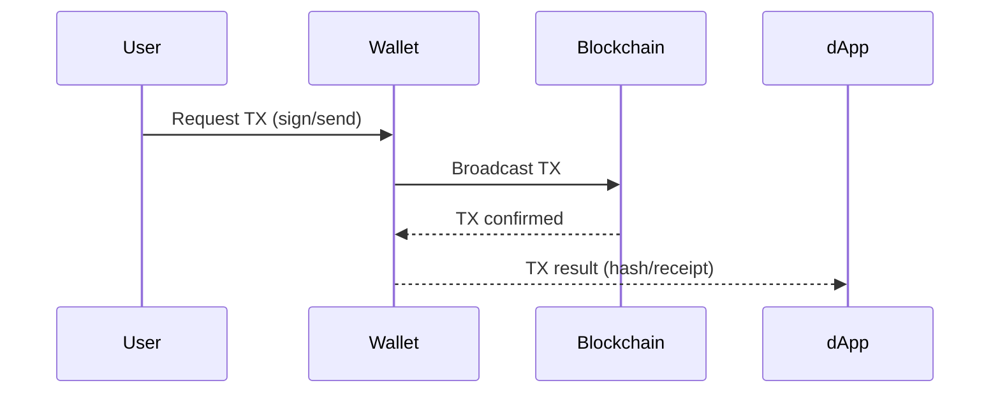

# Wallets in Web3

A crypto wallet is a tool that allows users to interact with blockchain networks. In Web3, wallets are essential for holding assets, signing transactions, and connecting to decentralized applications (dApps).

---

## 🔐 Types of Wallets

### 1. **Externally Owned Wallets (EOAs)**
- Controlled by private keys
- Examples: MetaMask, Rabby, Trust Wallet
- Used to initiate transactions

### 2. **Smart Contract Wallets**
- Logic-based accounts (e.g., multisig, social recovery)
- Examples: Argent, Safe (Gnosis Safe), ZeroDev

---

## 🛠 Popular Wallets

| Wallet       | Type           | Key Features                          |
|--------------|----------------|---------------------------------------|
| MetaMask     | EOA (browser)  | Most used, browser/mobile supported   |
| Rabby        | EOA (browser)  | Shows transaction previews            |
| Trust Wallet | EOA (mobile)   | Multi-chain, mobile-first             |
| Safe         | Contract-based | Multisig, DAO treasury                |
| Ledger       | Hardware       | Cold storage for maximum security     |

---

## ✍️ Signing & Authentication

- **Message Signing**: Proves ownership without sharing private key.
- **Sign-in with Ethereum (SIWE)**: Standard for Web3 login/auth.
- **Transaction Signing**: Approves token transfers or interactions.

---

## 🛡️ Security Tips

- Never share your **private key** or **seed phrase**.
- Use **hardware wallets** for large amounts.
- Watch out for **phishing** and fake dApps.
- Always double-check contract addresses.

---

## 📦 How Wallets Interact with dApps

---

## 🧪 Developer Tools

- **EIP-1193**: Standard for wallet providers (like MetaMask)
- **WalletConnect**: Connect mobile wallets to dApps
- **RainbowKit / Web3Modal**: Pre-built wallet connectors for frontend

---

## 📚 Resources

- [walletconnect.com](https://walletconnect.com/)
- [docs.metamask.io](https://docs.metamask.io/)
- [safe.global](https://safe.global/)
- [learnweb3.io](https://learnweb3.io/)

---

✍️ Created by [@alkhatib99](https://github.com/alkhatib99)
